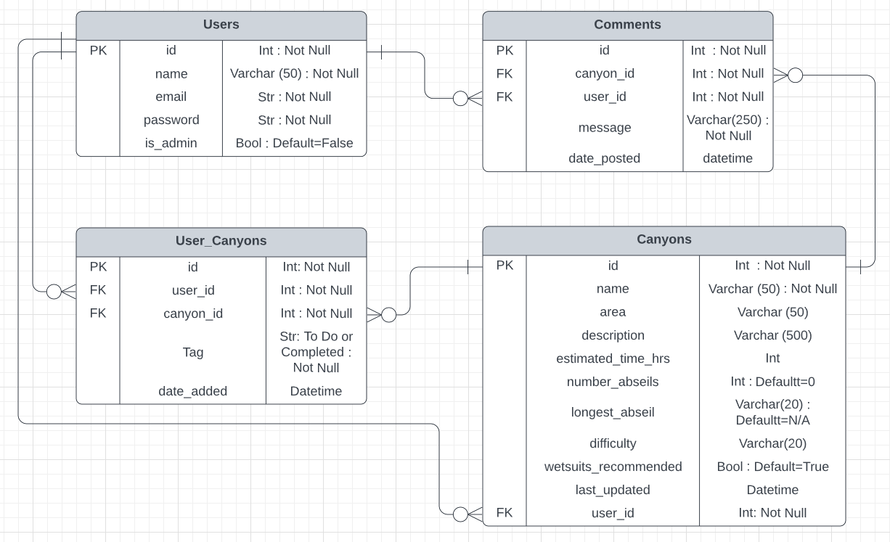
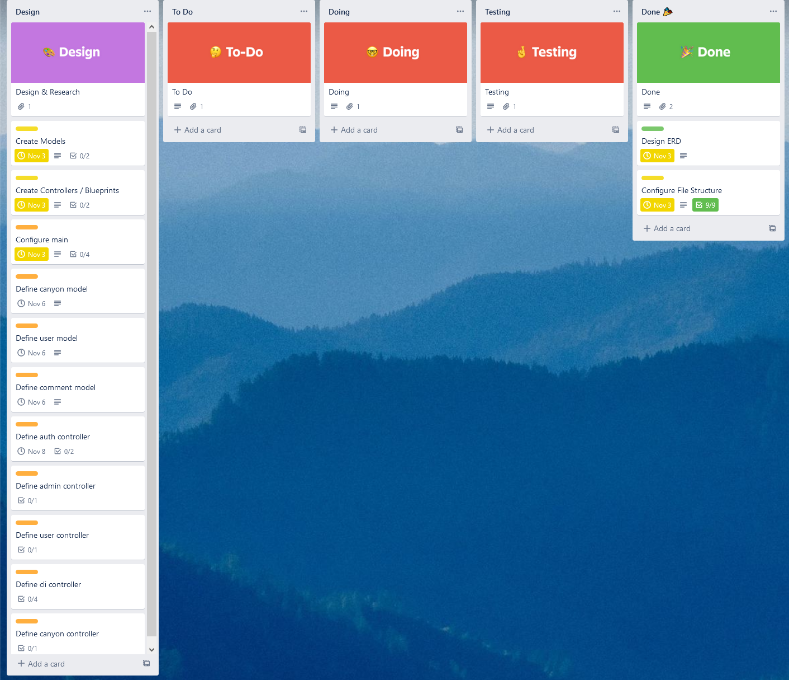
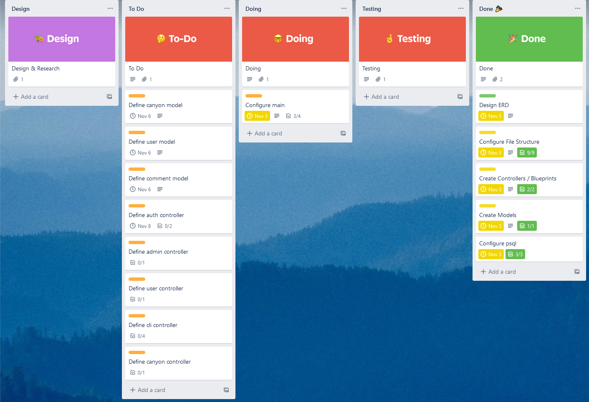
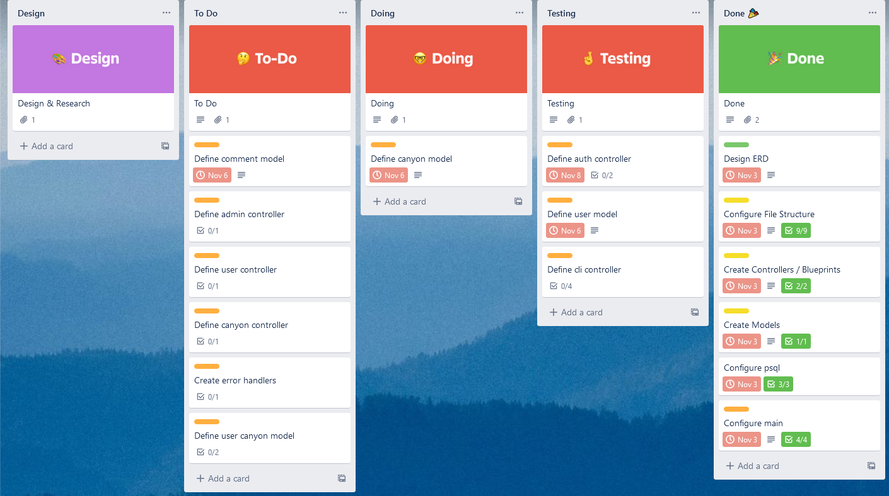
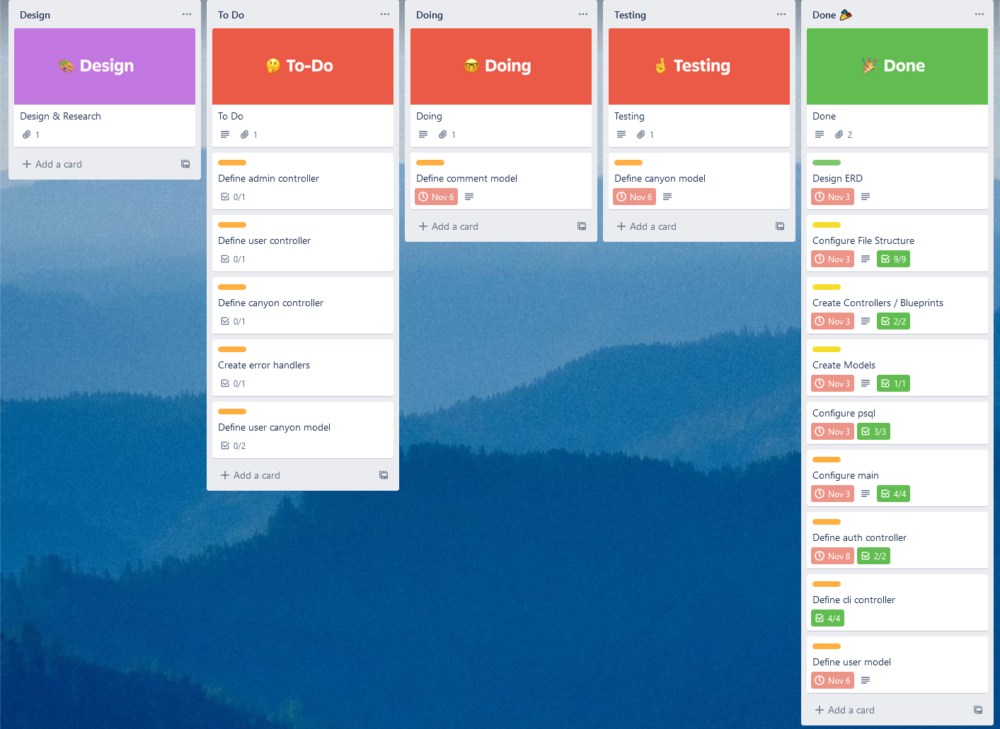
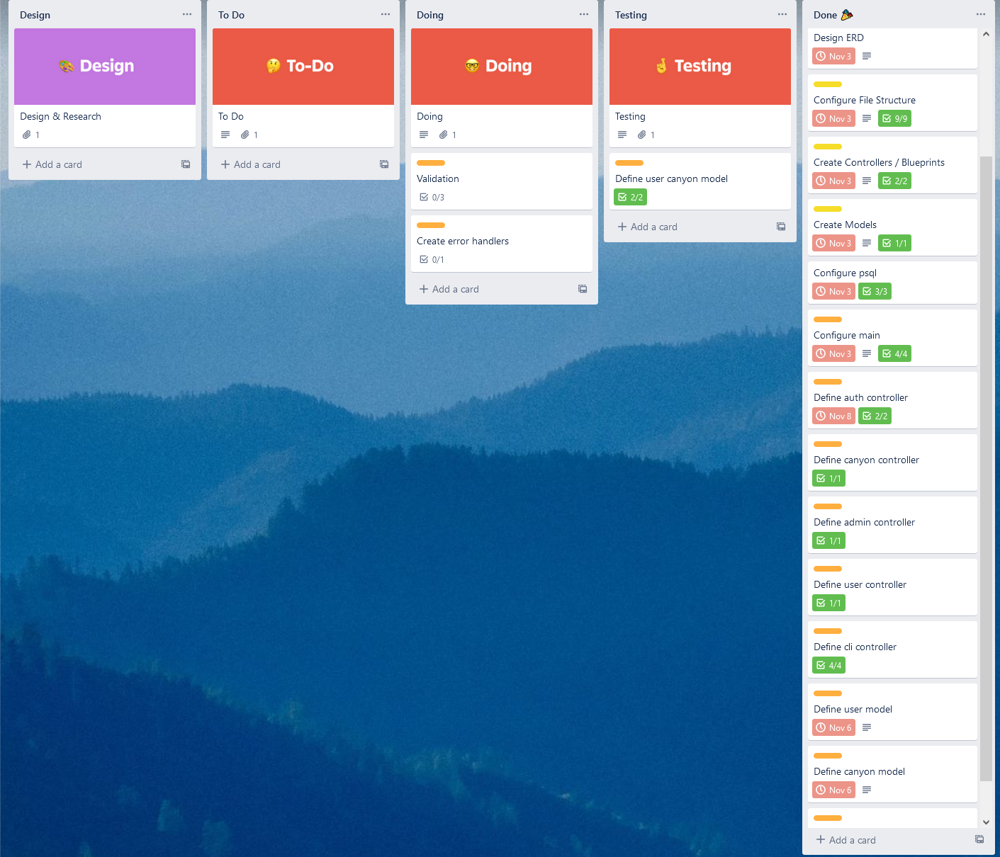
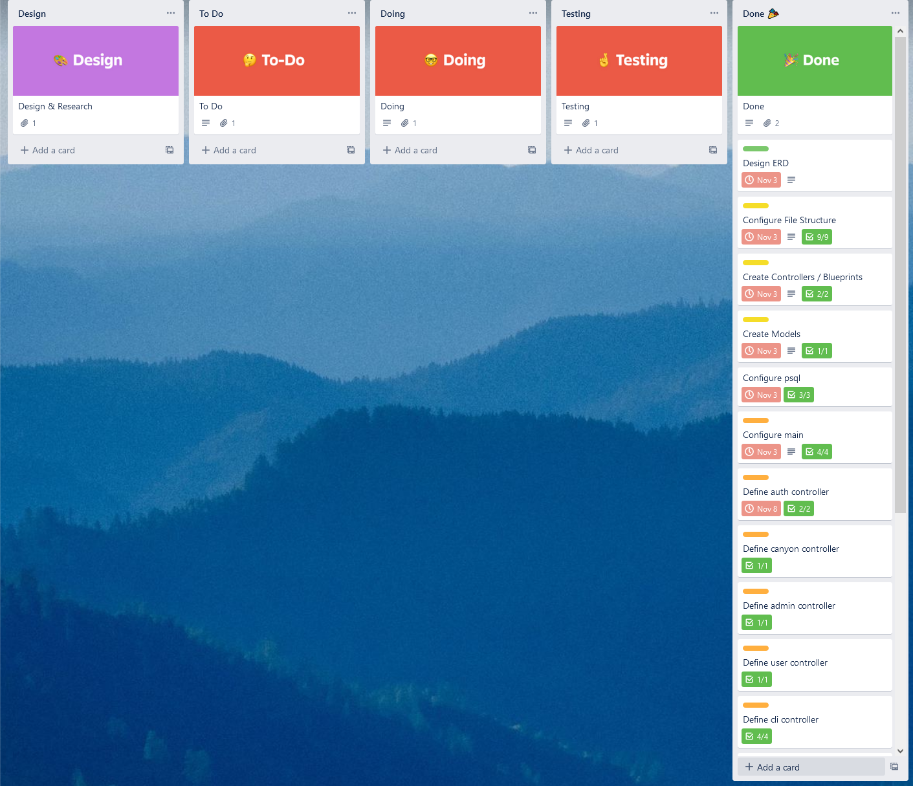

# **Canyoning API Webserver**

## Table Of Contents

  - [R1: Identification of the problem you are trying to solve by building this particular app](#r1)
  - [R2: Why is it a problem that needs solving?](#r2)
  - [R3: Why have you chosen this database system. What are the drawbacks compared to others?](#r3)
  - [R4: Identify and discuss the key functionalities and benefits of an ORM](#r4)
  - [R5: API Endpoint Documentation](#r5)
  - [R6: Entity Relationship Diagram](#r6)
  - [R7: Third party services](#r7)
  - [R8: Describe your projects models in terms of the relationships they have with each other](#r8)
  - [R9: Discuss the database relations to be implemented in your application](#r9)
  - [R10: Describe the way tasks are allocated and tracked in your project](#r10)
  - [Installation and Setup](#installation-and-setup)
  - [References](#references)

---

## **R1**
### **Identification of the problem you are trying to solve by building this particular app**
---
This project will provide a functioning webserver designed specifically for the canyoning community. It will provide a centralised place for information on Australian canyons and a direct forum for users to discuss particular canyons. Currently, information and discussions are spread over multiple websites and Facebook groups, making it difficult to find consistent information and resulting in many disjointed and confusing discussions where topics are not always immediately obvious and information can get easily lost in nested comments and over-filled news feeds.

Websites such as ozultimate.com provides great information about canyons but provides no way for users to communicate or discuss them. Websites such as canyoning.org.au provide a forum for discussion, but no way to discuss particular canyons and is generally a community with veyr low activity. Facebook groups such as 'Australian Canyoners' and 'OzCanyons Australia' provide lively discussion but no coherent forum as they are often flooded with posts about lost and found or photos, which is great from a helpful community perspective but makes it very difficult to find information about particular canyons.

This project aims to provide a way to combine the best features of each of these websites to keep information easy to access and keep discussions on topic and useful.

---

## R2 
### **Why is it a problem that needs solving?**

Canyoning can be a dangerous and even fatal adventure pursuit without correct information and preparation. Most incidents in canyons are due to human error, whether through bad technique, inaction, or often poor planning. Plenty of information exists with people willing to update others on conditions and changes to canyons over time, but this information and discussion is far too often obscured by being spread across multiple domains. This project aims to make discussions and information about canyoning easier to find, and as a result make the entire practice safer, by::

1. Making basic information about specific canyons easily accessible, such as minimum rope length required, difficulty, and number of abseils.
2. Crowd sourcing information regarding conditions by providing the ability to comment on specific canyons to let others know of any changes to conditions such as high flow, rock and tree falls, and broken abseil anchors.
3. Providing a way for users to mark canyons as 'To Do' or 'Completed' so they can check canyons and their associated comments they plan to do before their trip or provide helpful comments for canyons they have completed.

---

## R3 
### **Why have you chosen this database system. What are the drawbacks compared to others?**

The chosen database system for this project is PostgreSQL, a Relational Database Management System (RDBMS) using Structured Query Language (SQL) to query the database. This type of database system stores data in tables with rows and columns. NoSQL is the alternative to an RDBMS and stores data in JSON format.

NoSQL databses are fantastic at being flexible with data due to its schema. This is great for scenarios where data inputs are changing and the attributes are unknown. However this project is generally aware of all incoming data and how it should be handled, due to the RDBMS schema. A NoSQL database also excels at processing large quantities of data (TBs), however this application is unlikely to be handling such amounts of data now or in the future. For these data consistency, workload and flexibility concerns, an RDBMS was chosen for this project 

(1)

PostgreSQL was chosen for this project for the following reasons:

- Robust language support. PostgreSQL supports writing database functions in multiple programming languages. Most importantly it supports Python which was to be used for development, and works well with web frameworks such as Flask which was also used for this project.
- It is free and open-source which makes it an unbeatable candidate in regards to cost.
- It is inherently scalable, meaning this project can be easily expanded on in the future.
- Support for a large amount of data types. Although the data types used in this project are relatively standard, having the option of more complex data types such as ```money``` and ```range``` types will allow for exciting possibilities for the API in the future.
- Specific support for geographic objects, allowing it to be used for storing location based information that could be very useful for providing precise location data for canyoning.

  (2,3)

However, some drawbacks of using PostgreSQL include:

- As a side effect of PostgreSQL's robust compatibility, it is generally considered to be slower than alternatives such as MySQL, especially for read-heavy tasks. However, due to the scale of this API, the difference is likely to be negligibile or altogether unnoticeable.
- In addition to read-heavy tasks causing performance issues, PostgreSQL allocates about 10mb of memory per client connection, meaning if a large amount of users were to adopt this application, it may performance issues for users, resulting in a bad user experience.
- PostgreSQL has less third party tools and services associated with it as it has long been less popular than MySQL, despite it's growth in popularity over the last few years.

  (2,3)

---

## R4 
### **Identify and discuss the key functionalities and benefits of an ORM**

An Object Relational Mapper (ORM) is a library of code that turns data from a relational database table into objects that can be used by code.

The core functionality of an ORM is it's ability to map data to objects. Each record in a database table is converted to an instance of a class or object, where each column of the table maps to an attribute of the class. This abstraction of the data allows a developer to use their preferred programming language to interact with this object directly instead  of querying the database using SQL statements. This can speed up development as the developer does not have to switch between languages. It also means a different RDBMS can be used at different points throught development and even in production with little changes to the codebase if required (although it is not generally recommended if it can be avoided as errors can still occur).

(4)

Below is an example of an SQL query and the same query written in Python with SQLAlchemy as the ORM:

SQL:

```SQL
SELECT *
FROM usercanyons
WHERE user_id = '1' AND tag = 'Completed';
```

Python:

```py
stmt = db.select(UserCanyon).where(and_(
  UserCanyon.user_id == user_id, 
  UserCanyon.tag == 'Completed'
))
canyons = db.session.scalars(stmt)
```

By having the database mapped to Python classes, the way data is structured in the application is clearer and it allows for other developers to more easily understand the code and increases maintainability of the codebase. Having data as objects also allows for the developer to easily check data types of objects and troubleshoot code.

(4,5,6)

Another benefit of ORMs is they provide some but not complete protection from SQL injection by sanitising data. However, direct SQL queries executed with a programming language are not filtered in this way and could still provide an avenue for malicious attacks.

(5,6)

---

## R5 
### **API Endpoint Documentation**

[Go To API Endpoint Documentation](docs/API-Endpoints.md)

---

## R6 
### **ERD**



---

## R7 
### **Third party services**

- SQLAlchemy
- Flask (Marshmallow, Bcrypt, JWT Extended)
- psycopg2
- dotenv

---

## R8 
### **Describe your projects models in terms of the relationships they have with each other**

This API has 4 SQLAlchemy models that each represent an entity from the ERD in [R6](#r6). These models are created from the SQLAlchemy baseclass 'db.Model'. Each model then has it's own attributes added to this baseclass. These attributes are also shown in the ERD.

The SQLAlchemy models and their relationships are:

#### **User Model**

The User model is the only model without a foreign key. A User can exist by itself, but all other models require a User id as a foreign key. The User model has access to data form other models via its relationships shown here:

```py
canyons = db.relationship('Canyon', back_populates='user', cascade='all, delete')
comments = db.relationship('Comment', back_populates='user', cascade='all, delete')
user_canyons = db.relationship('UserCanyon', back_populates='user', cascade='all, delete')
```

By setting ```back_populates='user'```, a virtual column is created in the corresponding model in the realtionship. This means that there is a link back to the User model within the Canyon, Comment and UserCanyon model. Cascade delete means when a user is deleted, its related canyons, comments and user_canyons are also deleted, as these must all be associated with a user.

#### **Canyon Model**

The Canyon model has a foreign key attribute ```'user_id'``` which references the user that created the Canyon object, as seen below:

```py
user_id = db.Column(db.Integer, db.ForeignKey('users.id'), nullable=False)
```

This foreign key attribute must exist for the Canyon object to exist.
The Canyon object has relationships with Users, Comments and UserCanyons:

```py
user = db.relationship('User', back_populates='canyons')
comments = db.relationship('Comment', back_populates='canyon', cascade='all, delete')
user_canyons = db.relationship('UserCanyon' , back_populates='canyon', cascade='all, delete')
```

As with the User model, ```back_populates``` means that the Canyon model can be used in the other models with an established relationship. In the case of the User relationship, ```back_populates='canyons'``` is plural as a User can be associated with many canyons. However a Comment and a UserCanyon can only be associated with one canyon, thus those ```back_populates``` values are singular.

#### **Comment Model**

The comment model has two foreign key attributes; ```user_id``` and ```canyon_id```.

```py
canyon_id = db.Column(db.Integer, db.ForeignKey('canyons.id'), nullable=False)
user_id = db.Column(db.Integer, db.ForeignKey('users.id'), nullable=False)
```

These foreign keys link the Comment to a User and a Canyon. This relationship must exist as a Comment has to be made by a User and the Comment has to be made on a Canyon.

Similarly, these are the relationships that the Comment model has:

```py
canyon = db.relationship('Canyon', back_populates='comments')
user = db.relationship('User', back_populates='comments')
```

Once again, ```back populate``` creates a virtual column in the Canyon and User models for Comment.  
```back_populates='comments'``` references a plural form of comments to demonstrate the relationship; both a Canyon and a User can have many Comments associated with them.

#### **UserCanyon Model**

As with the Comment model, the UserCanyon model has two foreign key attributes; ```user_id``` and ```canyon_id```. Both of these attributes are required to make a UserCanyon object, as the UserCanyon model is designed to link a specific User with a specific Canyon they wish to do or tick off as completed.

The UserCanyon model also has the same relationships as the Comment model, where a Canyon and a User can have many UserCanyon entries associated with them. 

---

## R9 
### **Discuss the database relations to be implemented in your application**

The entities shown in the ERD in [R6](#r6) each represent a table in the database. These tables are User table, Canyon table, Comment table and UserCanyon table.

Relationships between these tables are formed by the primary key of one table existing as a foreign key in another table. This normalises the data by removing any redunancnies and duplicated data between tables, such that each table contains data about that entity and any data from another table can be linked via its id and foreign key. For example, the primary key of the User table is 'id' and this appears as a foreign key in the Canyon table. This relation means when a row is created in the Canyon table, the id of the user that created that row will be inserted as a 'user_id' in the Canyon table. This relation also means that if the same User were to be deleted from the User table, the row in the Canyon table with that user's id will also be deleted, as a Canyon must have a User that created it.

The specific relationships shown in [R6](#r6) are:

- A User can be the creator of as many Canyons as they like, including none. Therefore the relationship between user and canyons is **one to zero or many**. A Canyon must have only one User associated with creating it.
- A User can post as many Comments as they like, including none. Therefore the relationship between User and Comments is **one to zero or many**. A Comment must have only one User associated with it.
- A Canyon can have many Comments on it, including none. Therefore the relationship between Canyon and Comments is **one to zero or many**. A Comment must be associated with only one Canyon.
- A User can tag as many Canyons as they like as 'To Do' or 'Completed', including none, and creating a User_Canyon entry while doing so. Therefore the relationship between User and User_Canyons is **one to zero or many**. A User_Canyons entry must be associated with only one user.
- A Canyon can be tagged as 'To Do' or 'Completed' by many Users, including none. Therefore the relationship between Canyon and User_Canyons is **one to zero or many**. A User_Canyons entry must be associated with only one canyon.

---

## R10 
### **Describe the way tasks are allocated and tracked in your project**

Trello was used for project management during development of this API. The kanban board was used to create specific cards to be completed during development. These included the initial file setup, creating blueprints, models, routes, authentication and validation. Each card contained a checklist of items required to complete the goal of that card. Cards were color coded according to whether they were part of the design, setup or actual API code. Cards were also assigned due dates and these dates were generally met. The kanban board consisted of 5 categories: Design, To Do, Doing, Tesitng and Done. Cards were moved through these categories as the development process proceeded. This can be seen in the screenshots below.

The Trello board can be found [here](https://trello.com/b/R4psmhnY/t2a2-api-webserver-canyoning-api)

#### **Screenshots**








## **Installation and Setup**

## **References**

1. https://hevodata.com/learn/relational-database-vs-nosql/#sf

2. https://www.prisma.io/dataguide/postgresql/benefits-of-postgresql

3. https://www.cybertec-postgresql.com/en/postgresql-overview/advantages-of-postgresql/

4. https://www.fullstackpython.com/object-relational-mappers-orms.html
   
5. https://dev.to/tinazhouhui/introduction-to-object-relational-mapping-the-what-why-when-and-how-of-orm-nb2

6. https://blog.yellowant.com/orm-rethinking-data-as-objects-8ddaa43b1410